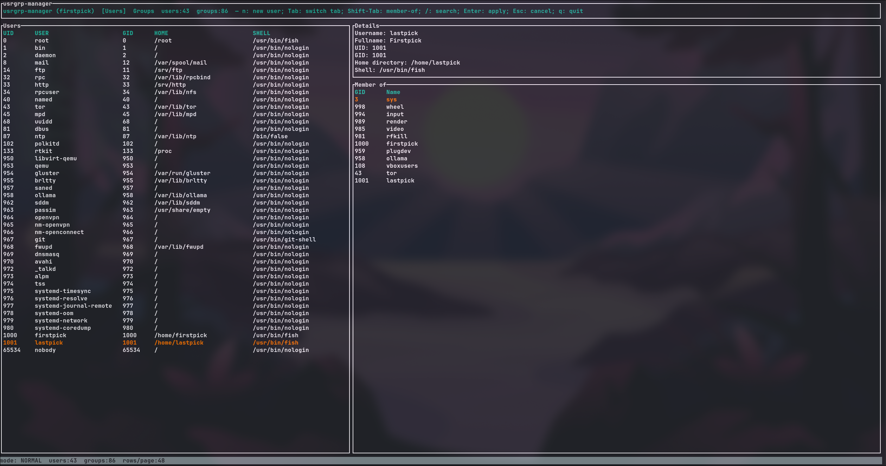

UsrGrp-Manager-TUI (Rust Users/Groups Manager TUI)
================

<details>
  <style>
    /* Simple, readable styles for GitHub rendering */
    body {
      background-color: #0f172a;
      font-family: 'JetBrains Mono', monospace;
      color: #e2e8f0;
    }
    h1, h2, h3, h4, h5, h6 {
      color: #93c5fd;
    }
    a { color: #60a5fa; text-decoration: underline; }
  </style>
</details>

<div align="center" style="background-color: #0f172a; border-left: 5px solid #60a5fa; padding: 1em; margin-bottom: 1em; color: #e2e8f0;">
  <h2 style="color: #93c5fd;">Hello Sysadmins and TUI Enthusiasts!</h2>
  <p style="font-size: 1.1em; font-weight: bold;">Welcome to UsrGrp-Manager-TUI</p>
  <p>A keyboard-driven TUI to browse and manage users and groups on Linux.</p>
  <p style="color: #fbbf24;">
    ❗ Read-only exploration is safe. Write operations require privileges and ask for confirmation.
  </p>
</div>

## Table of Contents
- [Introduction](#introduction)
  - [Status](#status)
  - [Quick Start](#quick-start)
- [Environment Setup](#environment-setup)
- [Prerequisites](#prerequisites)
- [Installation Details](#installation-details)
- [Project Structure](#project-structure)
- [Usage & Keybindings](#usage--keybindings)
- [What’s Implemented](#whats-implemented)
- [Notes & Requirements](#notes--requirements)
- [Tests](#tests)
- [Troubleshooting](#troubleshooting)
  - [Permissions](#permissions)
  - [External Tools Missing](#external-tools-missing)
  - [Parsing Issues](#parsing-issues)
- [Contributing & Support](#contributing--support)
- [License](#license)

## Introduction

Keyboard‑driven terminal app to view and manage users and groups. Browse accounts, see memberships, search, and make common changes: rename users, update names or shells, adjust group membership. Safe to explore without admin rights; asks for permission to apply changes. Linux‑focused. Written in Rust.

### Screenshot


### Demo


### Status
Alpha. Read‑only browsing is safe; write operations require privileges and are still limited.

Alpha means:
- Interfaces and keybindings may change without notice.
- Some actions are intentionally guarded (e.g., user deletion requires confirmation; optional home removal).
- Error handling, edge cases, and performance are still being improved.

### Quick Start

```bash
# Build and run (release)
cargo build --release
cargo run --release

# Optional: set logging level
USRGRP_MANAGER_LOG=info   # or debug, trace
```

## Environment Setup

- Linux/BSD terminals supported; primary target is Linux.
- Read operations work without privileges.
- Write operations (create/delete users/groups, modify memberships, change shell/password) require appropriate privileges (root or sudo).

## Prerequisites

- Rust toolchain (stable) and Cargo
- Linux system with standard user/group management tools:
  - `usermod`, `useradd`, `userdel`
  - `groupadd`, `groupdel`, `gpasswd`
  - `chpasswd`, `chage`

## Installation Details

- Build: `cargo build --release`
- Run: `cargo run --release`
- Logging: set `USRGRP_MANAGER_LOG=info|debug|trace` (default: `info`)
- Feature flags: `file-parse` exists, but enumeration currently parses `/etc/passwd` and `/etc/group` by default.

### Install from AUR

- usrgrp-manager-git: latest development version from the main branch
- usrgrp-manager-bin: prebuilt binaries from the latest release

Install yay (AUR helper) if needed:
```bash
sudo pacman -S --needed git base-devel
git clone https://aur.archlinux.org/yay.git
cd yay
makepkg -si
```

Using yay:
```bash
yay -S usrgrp-manager-git
yay -S usrgrp-manager-bin
```

Using paru:
```bash
paru -S usrgrp-manager-git
paru -S usrgrp-manager-bin
```

After installation:
```bash
usrgrp-manager
```

## Project Structure
```
src/
  main.rs                    # Entry point
  app/
    mod.rs                   # AppState, core types
    update.rs                # Event handling, business logic
  ui/
    mod.rs                   # Main render function, layout
    users.rs                 # Users tab (table + details + modals)
    groups.rs                # Groups tab (table + details + modals)
    components.rs            # Shared UI helpers (status bar, etc.)
  sys/
    mod.rs                   # Current SystemAdapter
  search.rs                  # Search functionality
```

## Usage & Keybindings

- Quit: `q`
- Switch tab: `Tab` (Users ↔ Groups)
- Users tab focus: `Shift+Tab` toggles Users list ↔ Member‑of list
- Move: `↑/k`, `↓/j`
- Page: `←/h` (previous page), `→/l` (next page)
- Search: `/` to start, type query, `Enter` to apply, `Esc` to cancel
- Open actions on selection: `Enter`
- In popups: `↑/k`, `↓/j`, `PageUp`, `PageDown`, `Enter`, `Esc`

- New user: `n` (toggle "Create home" with `Space`)
- Delete confirmation: `Space` toggles "Also delete home"
- Password: Actions → Modify → Password
  - Set/change: masked input with confirm; toggle "must change at next login" with `Space`; select Submit and press `Enter`
  - Reset: expire password immediately (forces change at next login)

## What’s Implemented

- Users tab
  - Table of users (from `/etc/passwd`), selection, paging
  - Detail pane: UID, GID, name, home, shell
  - Member‑of pane: primary and supplementary groups
  - Create user (`useradd`; optional `-m` to create home)
  - Delete user (`userdel`; optional `-r` to remove home)
  - Password management:
    - Set/change (masked via `chpasswd`, optional "must change at next login")
    - Reset (expire now via `chage -d 0`)
  - Actions → Modify:
    - Add user to groups (via `gpasswd -a`)
    - Remove user from groups (via `gpasswd -d`, excluding primary group)
    - Change username (`usermod -l`)
    - Change full name (GECOS, `usermod -c`)
    - Change login shell (pick from `/etc/shells`, `usermod -s`)

- Groups tab
  - Table of groups (from `/etc/group`), selection, paging
  - Detail pane and members list
  - Actions:
    - Create group (`groupadd`)
    - Delete group (`groupdel`)
    - Modify members (add/remove users)

- Search
  - Simple substring filter for Users and Groups tabs

## Notes & Requirements

- Linux/BSD only. macOS behavior may differ (Directory Services).
- Write actions call system tools and require appropriate privileges (root or sudo): `usermod`, `gpasswd`, `groupadd`, `groupdel`, `useradd`, `userdel`, `chpasswd`, `chage`.
- User deletion is implemented with confirmation and optional home removal.

## Tests

- Run all tests: `cargo test`

What’s covered today:
- Unit tests for parsers in `src/sys/mod.rs` (fake `/etc/passwd` and `/etc/group` files).
- Unit tests for filtering in `src/search.rs` (case‑insensitive user/group search, membership matching).

Guidelines:
- Keep small unit tests inline next to the code with `#[cfg(test)]` for private helpers and pure logic.
- For broader or cross‑module tests, add a `src/lib.rs` exposing modules (e.g., `pub mod app; pub mod search; pub mod sys;`) and place integration tests in `tests/`.
- Avoid invoking privileged commands (`useradd`, `gpasswd`, etc.) in tests. Prefer testing pure parts (parsing, filtering) or introduce a trait to mock `SystemAdapter` in higher‑level tests.

Optional:
- UI snapshot/sanity tests can be written using `ratatui`’s test backend (and, if desired, a snapshot tool like `insta`). These should render minimal views and assert on expected labels/highlights, not terminal specifics.

## Troubleshooting

### Permissions
```bash
# Verify you have sufficient privileges when applying changes
id
sudo -v  # refresh sudo credentials
```

### External Tools Missing
```bash
# Check required tools are available
command -v useradd usermod userdel groupadd groupdel gpasswd chpasswd chage
```

### Parsing Issues
```bash
# Inspect passwd/group files
getent passwd | head -n 5
getent group  | head -n 5

# Validate shells list
cat /etc/shells
```

If problems persist, run with verbose logs:
```bash
USRGRP_MANAGER_LOG=debug cargo run --release
```

## Contributing & Support

- Open issues or pull requests on GitHub
- Suggestions and feedback welcome!

## License

See [LICENSE](LICENSE) for details.
