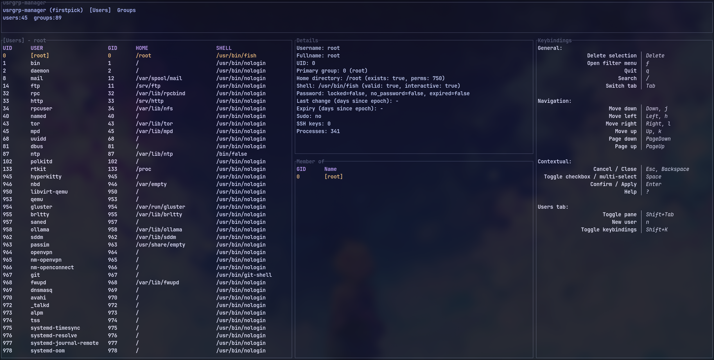
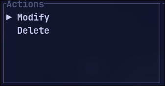
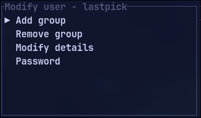
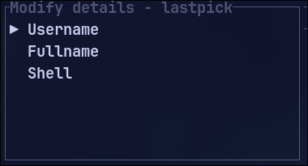
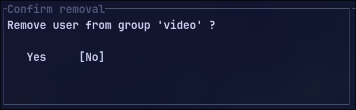
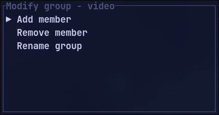
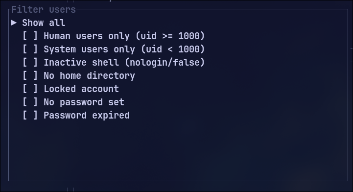

UsrGrp-Manager-TUI (Users/Groups Manager TUI)
================

<details>
  <style>
    /* Simple, readable styles for GitHub rendering */
    body {
      background-color: #0f172a;
      font-family: 'JetBrains Mono', monospace;
      color: #e2e8f0;
    }
    h1, h2, h3, h4, h5, h6 {
      color: #93c5fd;
    }
    a { color: #60a5fa; text-decoration: underline; }
  </style>
</details>

<div align="center" style="background-color: #0f172a; border-left: 5px solid #60a5fa; padding: 1em; margin-bottom: 1em; color: #e2e8f0;">
  <h2 style="color: #93c5fd;">Welcome Sysadmins and TUI Users!</h2>
  <p style="font-size: 1.1em; font-weight: bold;">Welcome to UsrGrp-Manager-TUI</p>
  <p>A keyboard-driven TUI to browse and manage users and groups on Linux.</p>
  <p style="color: #fbbf24;">
    ❗ Read-only exploration is safe. Write operations require privileges and ask for confirmation.
  </p>
</div>

## Quick Links

- 📖 **[Complete Documentation](https://github.com/Firstp1ck/UsrGrp-Manager-TUI/wiki)** – Installation, usage, shortcuts, troubleshooting
- 🚀 **[Quick Start](https://github.com/Firstp1ck/UsrGrp-Manager-TUI/wiki/Quick%E2%80%90Start)**
- ⌨️ **[Keyboard Shortcuts](https://github.com/Firstp1ck/UsrGrp-Manager-TUI/wiki/Keyboard%E2%80%90Shortcuts)**
- 🆘 **[Troubleshooting & FAQ](https://github.com/Firstp1ck/UsrGrp-Manager-TUI/wiki/Troubleshooting%E2%80%90FAQ)**

## What is it?

Keyboard-driven terminal app to view and manage users and groups on Linux. Browse accounts, see memberships, search, and make common changes: rename users, update names or shells, adjust group membership. Safe to explore without admin rights; asks for permission to apply changes.

**Status:** Alpha. Read-only browsing is safe; write operations require privileges and are still limited.

### Screenshot



### Demo


## Installation

### Quick Install (Arch Linux)

Using yay:

```bash
yay -S usrgrp-manager-git      # Latest from main branch
# or
yay -S usrgrp-manager-bin      # Prebuilt binary
```

Using paru:

```bash
paru -S usrgrp-manager-git
# or
paru -S usrgrp-manager-bin
```

### Build from Source

```bash
cargo build --release
./target/release/usrgrp-manager
```

For other installation methods, see [Install Documentation](https://github.com/Firstp1ck/UsrGrp-Manager-TUI/wiki/Install).

## Running

```bash
usrgrp-manager              # Browse read-only
sudo usrgrp-manager         # Required for write operations
```

## Features

### Users
- View users from `/etc/passwd`
- Create/delete users
- Modify username, full name, shell
- Manage group membership
- Set/change/reset passwords
- View user details: UID, GID, home, shell, password status, sudo membership, SSH keys, processes









### Groups
- View groups from `/etc/group`
- Create/delete groups
- Manage members
- View group details: GID, classification, membership count, privilege level



### General
- Fast search/filter (case-insensitive substring matching)



- Safe paging and navigation
- Keyboard-driven (no mouse required)
- Confirmation prompts for destructive actions

## Prerequisites

- Rust toolchain (stable) + Cargo
- Linux system with standard user/group tools: `usermod`, `useradd`, `userdel`, `groupadd`, `groupdel`, `gpasswd`, `chpasswd`, `chage`

## Project Structure

```text
src/
  main.rs                    # Entry point
  app/
    mod.rs                   # AppState, core types
    update.rs                # Event handling, business logic
  ui/
    mod.rs                   # Main render function, layout
    users.rs                 # Users tab (table + details + modals)
    groups.rs                # Groups tab (table + details + modals)
    components.rs            # Shared UI helpers (status bar, etc.)
  sys/
    mod.rs                   # Current SystemAdapter
  search.rs                  # Search functionality
```

## Configuration

```bash
# Logging level
USRGRP_MANAGER_LOG=info    # or debug, trace

# Sudo group name (for sudo membership checks)
export UGM_SUDO_GROUP=sudo   # defaults to 'wheel' if unset
```

## Tests

```bash
cargo test    # Run all tests
```

What's covered:
- Unit tests for parsers in `src/sys/mod.rs`
- Unit tests for filtering in `src/search.rs`

## Contributing & Support

- Open issues or pull requests on GitHub
- See [CONTRIBUTING.md](CONTRIBUTING.md) for guidelines
- Feedback and suggestions welcome!

## License

See [LICENSE](https://github.com/Firstp1ck/UsrGrp-Manager-TUI/blob/main/LICENSE) for details.
